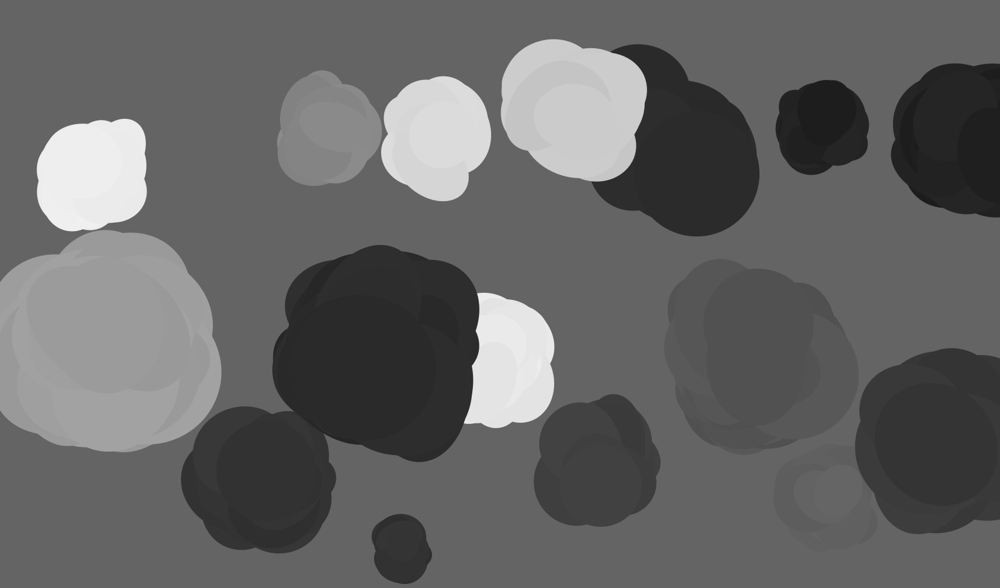
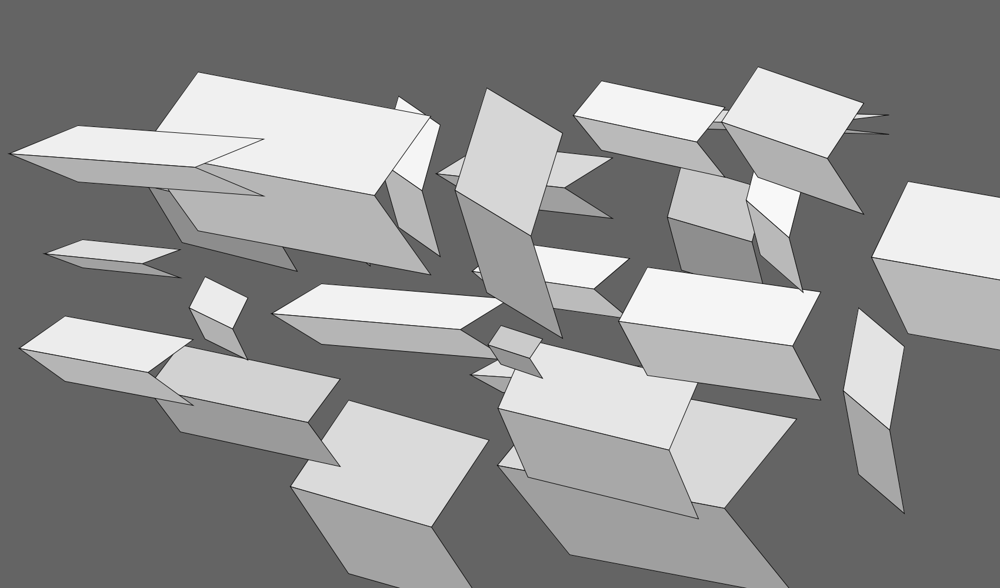

# Sketchy Business

A series of experiments made with [Processing](https://processing.org/)

## Puddles

## Clouds

## Slabs

## Reference Material
[Calculate bounding box of arbitrary pixel-based drawing](https://stackoverflow.com/a/10994458/303873)